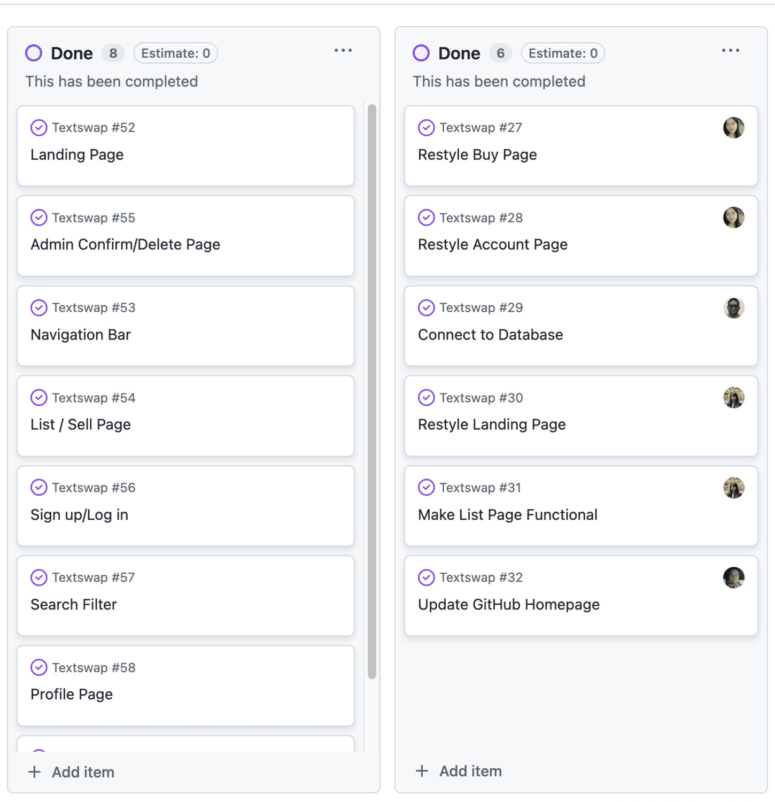
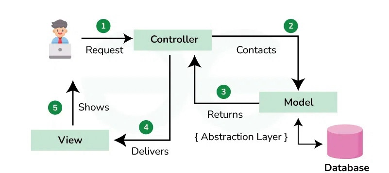

## Building Skills & Code

My ICS 314 Software Engineering class is coming to an end and it's been an excellent learning experience. While this class mostly focused on web application development, it still has taught me a lot when it comes to teaching me the fundamental concepts of software engineering. Some of the concepts I learned include **Agile Project Management**, **Configuration Management**, and **Design Patterns**. These three concepts, which I will discuss more thoroughly below, have been vital in this class and to my understanding of software engineering.

## Agile Project Management

Agile Project Management is an approach to managing projects in which tasks are broken down into small and manageable tasks (often called _sprints_). This approach emphasizes flexibility and collaboration and is highly beneficial for team collaboration. For example, in my ICS 314 class, I worked in a group of four people on a project to create a marketplace for second-hand books. Agile Project Management benefitted us by enabling us to effectively divide tasks and allow transparent collaboration between our members. We broke the project down into smaller and manageable _sprints_ with each member taking ownership of specific features such as the database, user interface, front end, back end, etc. Working in _sprints_ allowed us to develop our project relatively quickly and improve it based on feedback. If issues occurred, we could easily pivot and address them, whether it was a bug in the code or errors in an algorithm.

  

## Configuration Management

Configuration Management is the process of tracking and controlling changes to a software system. Using Configuration Management allows for consistency throughout a software system and prevents errors as the system changes over time. There are a few key practices in Configuration Management which include planning, version control, change control, and deployment. Planning focuses on defining how to manage the system and its changes throughout its lifecycle. Version control tracks and manages changes to the system over time. Change control involves documenting the changes to the system. Finally, deployment is the process of moving the software from development to production.

Git and GitHub were among the primary tools I used to implement configuration management throughout this course. Git is an open source version control system that allows developers to track and manage changes to their code over time. GitHub, on the other hand, is a cloud-based platform that simplifies version control by providing an interface for managing Git repositories. While I am still unfamiliar with using Git and its commands through the terminal, GitHub allows me to use configuration management and more specifically, version control, throughout my coding projects and assignments.

  

## Design Patterns

Design Patterns refers to reusable solutions to commonly occurring problems when developing a software system. These solutions provide tried-and-true approaches to handling recurring design challenges. Using Design Patterns allows developers to avoid reinventing the wheel, reduce errors, create more maintainable and scalable software, and promote code reusability.

There are various types of design patterns, such as Factory, Singleton, and Observer. However, I believe that the most important and widely used pattern in Software Engineering is Model-View-Controller (MVC). MVC divides an application into three components, each of which has a specific responsibility. Model manages the application's data and logic, such as database interactions and data validation. View is responsible for representing data or information to the user through a graphic user interface (GUI). Controller receives user input and updates the model based on the input.

  

