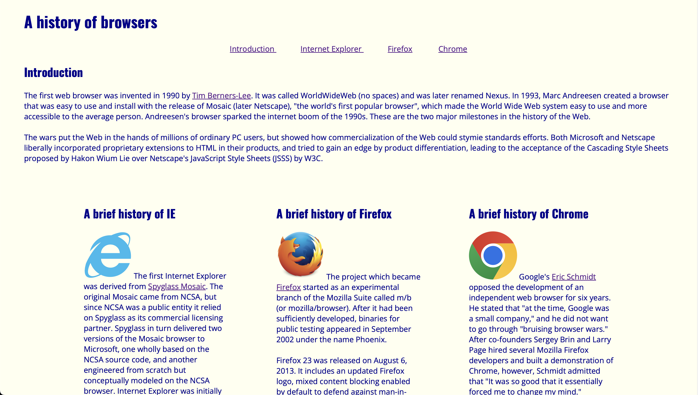
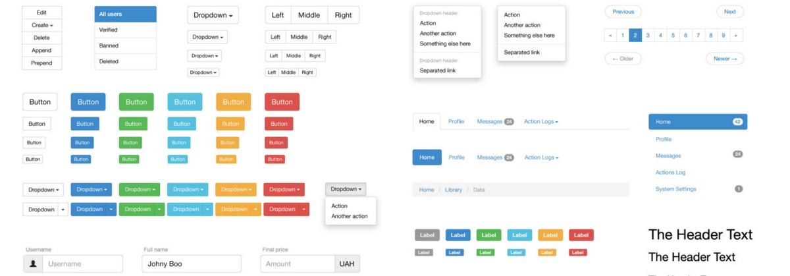

## Building Blocks

I recently began my journey in learning web development, and like most people, I started with the basics: HTML and CSS. At first, it felt like I was constructing a website with building blocks. I could use headings, paragraphs, and images to format my website with HTML. Then I could use CSS to add in a little bit of color and styling to my website.

However, as I progressed, I realized that if I wanted to create more complex websites, the basics might just not be enough. Yeah, I could create a simple website, but it lacked responsive designs and interactive features making it feel a bit lackluster. For example, the first website I created was a one-page site that discussed the history of browser.

<p align="center">
  
</p>

## Beyond HTML and CSS

Fortunately, UI frameworks such as Bootstrap alleviated my concerns. Bootstrap provides a library of pre-designed components that help me build more visually appealing and functional websites. Components like the grid system, navigation bars, buttons, dropdowns, and scrollers allow me to create intuitive layouts and improve user interaction. In addition to its components, Bootstrap also has a library of logos and icons that we can use to enhance our websites.

<p align="center">
  
</p>

## Mastering the Framework

As much as Bootstrap helps with web development, it also came with a lot of challenges. The sheer number of classes, components, and syntax was hard to get a grip on. I often found the code of components to be lengthy and confusing. For example, in the example code from [Bootstrap's website](https://getbootstrap.com/docs/4.0/components/navbar/), I encountered syntax which left me confused about their purpose in the component:

```
<nav class="navbar navbar-expand-lg navbar-light bg-light">
  <a class="navbar-brand" href="#">Navbar</a>
  <button class="navbar-toggler" type="button" data-toggle="collapse" data-target="#navbarSupportedContent" aria-controls="navbarSupportedContent" aria-expanded="false" aria-label="Toggle navigation">
    <span class="navbar-toggler-icon"></span>
  </button>
```

Also, getting the components to look the way I wanted to was a bit difficult. For instance, I wanted to create a dropdown button without the little caret icon and I was getting frustrated trying to find solutions. Then I realized that I just needed to remove `dropdown-toggle` in my button class.
