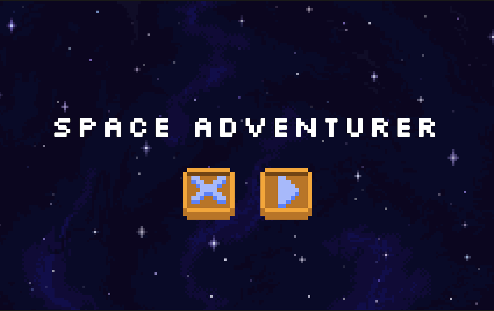

## Journey of the Space Adventurer
For my high school senior project, I developed a 2D platformer video game titled *Space Adventurer Demo*. This game, inspired by the Metroid game franchise,  features a classic platforming experience and integrates a shooting mechanic as a core element of gameplay. The story of my game follows a lost space adventurer that crashed into an unknown planet. The objective is to repair your rocket ship by collecting three gears while traversing the unknown planet, overcoming obstacles, slaying hostile creatures, and defeating a large alien dragon boss.
## From Scratch to Unity
Prior to starting my senior project, I had little to no experience with coding, scripting, or programming, having only used Scratch for some engineering class assignment. However, inspired by my interests in video games and my experience with block-based visual programming, I wondered if I could use this approach to develop a video game. Fortunately, Unity offered an asset called Bolt, which allowed visual scripting to be used within their game engine. ([Bolt has since been replaced by Unity Visual Scripting](https://assetstore.unity.com/packages/tools/visual-scripting/bolt-now-is-unity-visual-scripting-is-built-in-to-unity-2021-new-163802?utm_source=YouTube&utm_medium=social&utm_campaign=evangelism_global_generalpromo_2020-09-16_bolt-overview-dl-bolt-assetstore)) This tool enabled me to develop a video game despite my lack of experience with scripting.  
## Tutorial and Triumphs
Starting this project involved a steep learning curve. To get up to speed with using Unity and Bolt, I relied heavily on Youtube tutorials as well as other online resources. The [official Unity tutorial](https://www.youtube.com/watch?v=aQceChK-kC4) guided me through the basics of Bolt and served as the foundation for my game. As I began developing my game, I learned how to navigate through Unity’s interface and utilize its tools. I used Bolt for visual scripting, to create game mechanics, and manage events. I also got into designing pixel art and animating sprites for characters and the environment. 
## Glitches in the Galaxy
While I consider my senior project to be a success as I was able to develop a functioning and somewhat enjoyable video game, there are a few noticeable flaws. One issue involves a bug where flying hostile creatures can phase through terrain and sometimes walking hostile creatures can float on air. Additionally, the sound design of my game is not that great and could be improved. For example, there are some instances, such as during the death scene or game over scene, where no sound effect plays.
 
My 2D platformer video game is playable on this website: [https://dbolo.itch.io/space-adventurer-demo](https://dbolo.itch.io/space-adventurer-demo) 

  

