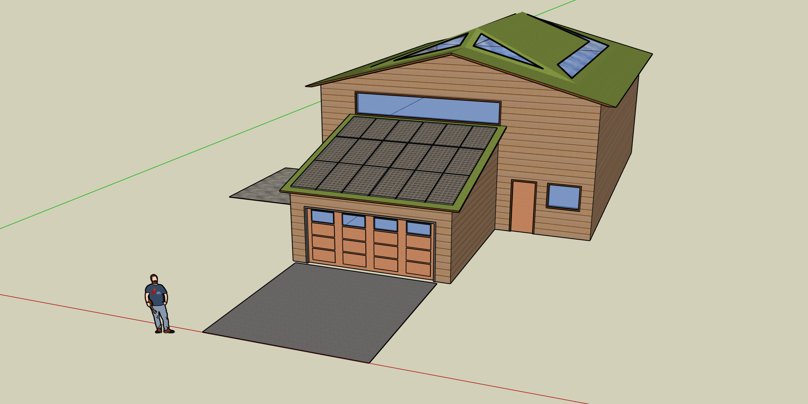
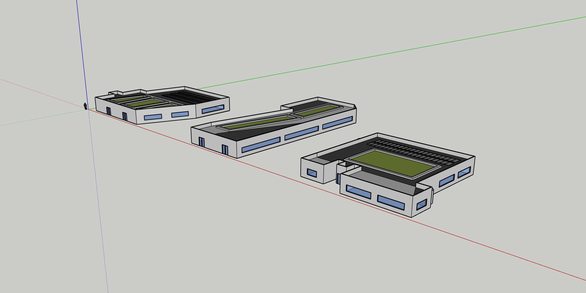
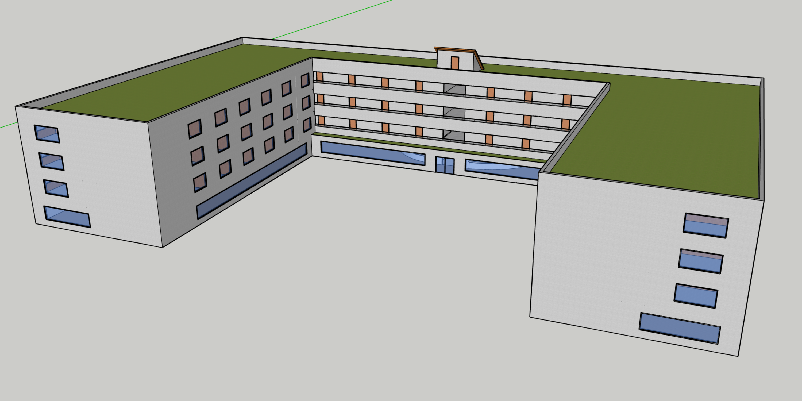

## Sustainable Solutions
In my SSM 101 class, I was involved in a group project in which we tackled the challenge of designing a city plan that followed the principles of Low Impact Development. Given certain constraints, we focused on using sustainable stormwater management practices in the hopes of reducing the environmental impact of development on water resources. Our plan featured several key elements, such as rainwater harvesting systems, green roofs, and solar panels. In addition, we based our planning on the sponge city model. A sponge city is a landscape design concept that aims to effectively manage rainwater by incorporating features that allow urban environments to absorb, store, and slowly release water.
## From Blueprint to Reality
My primary role in the group project was to create detailed 3D models of every building within the city plan, which included commercial properties, residential housing, and a tourism building. I used Sketchup for this task, which allowed me to use my prior knowledge of AutoCAD and Blender to create visual representations of our designs. Other responsibilities in the group included creating slides, drawing blueprints for our city planning, and leading our presentation.  

  
  
  

## Lessons in Sustainability
Working on the group project allowed me to gain a better understanding of sustainability, Low Impact Development principles, and how to apply them into urban planning. Creating 3D models on SketchUp also helped me improve my skills in AutoCAD and Blender. Additionally, collaborating with my group helped me appreciate the importance of communication and teamwork.

