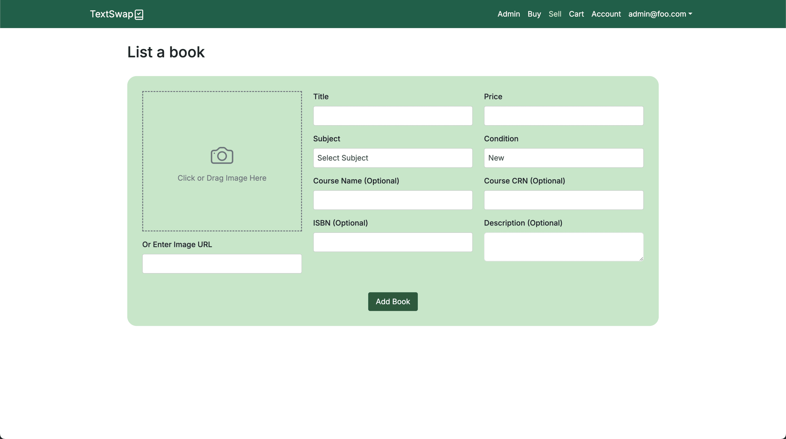
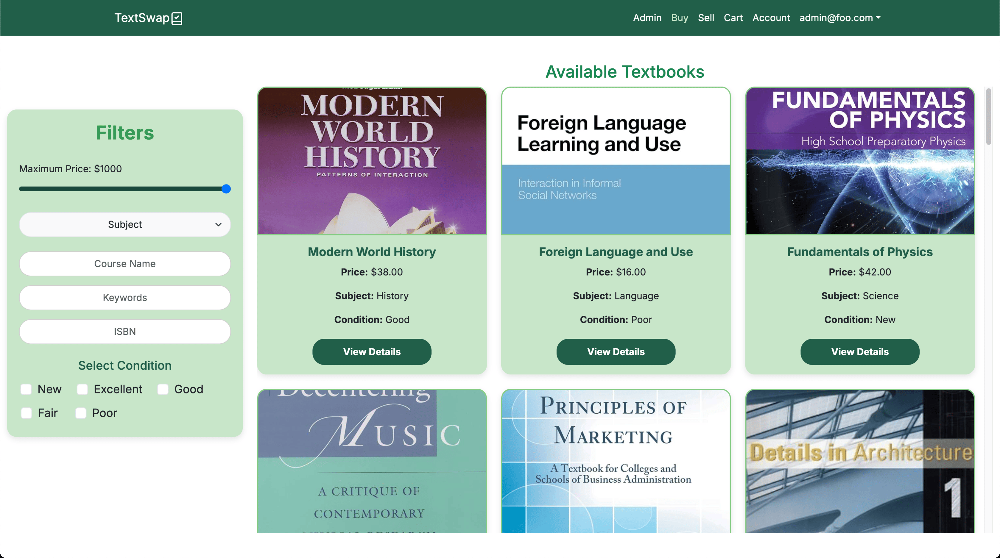
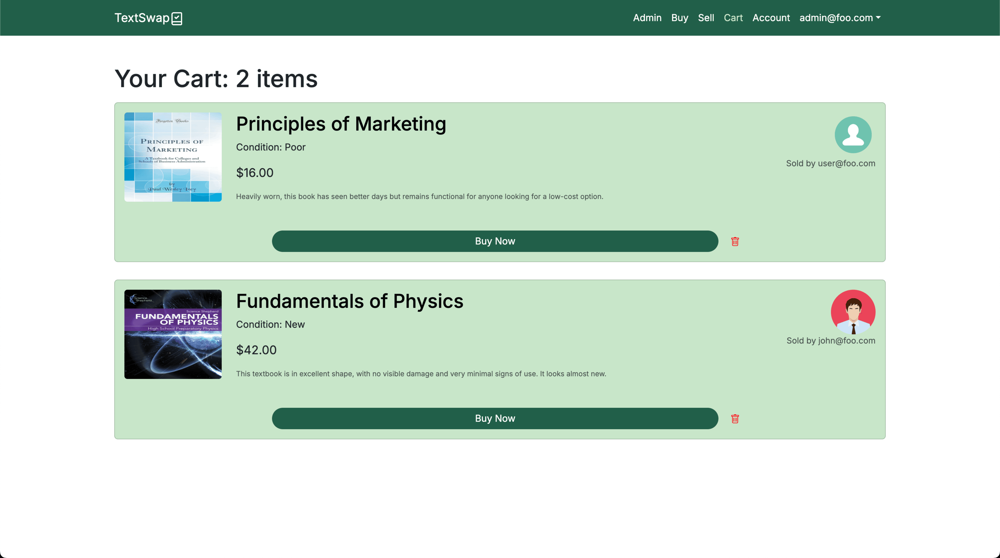
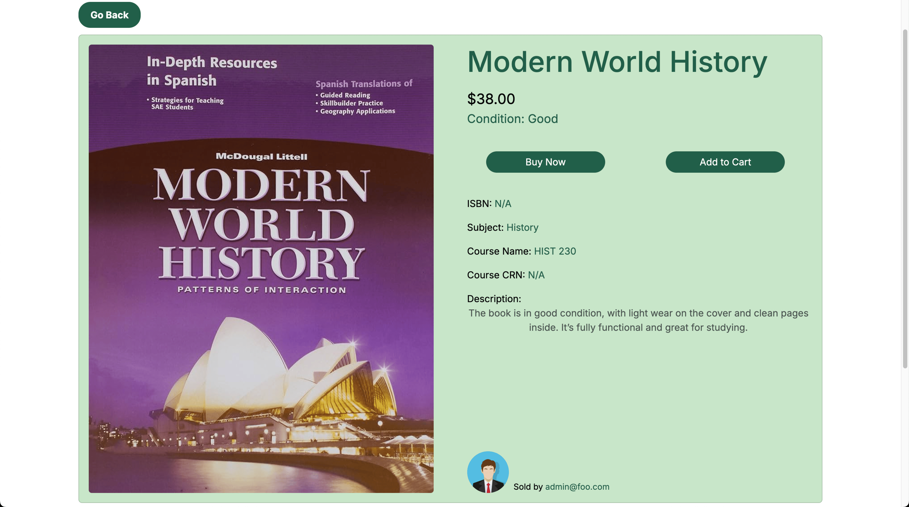
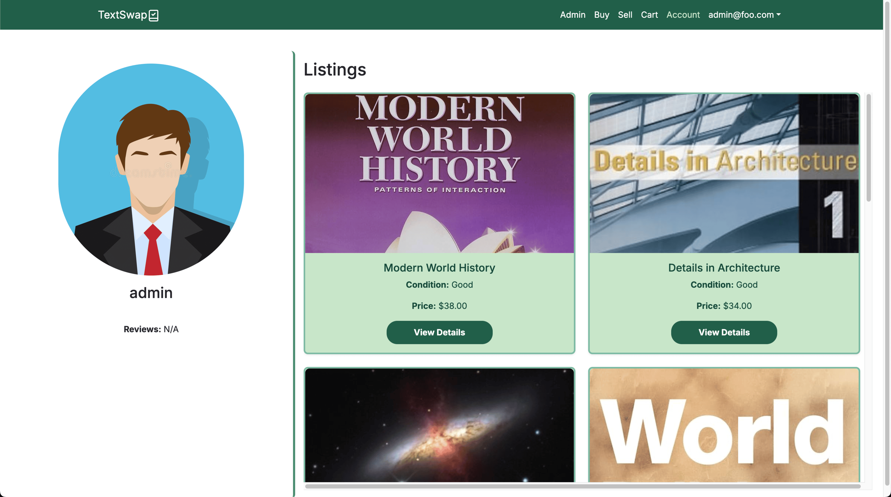
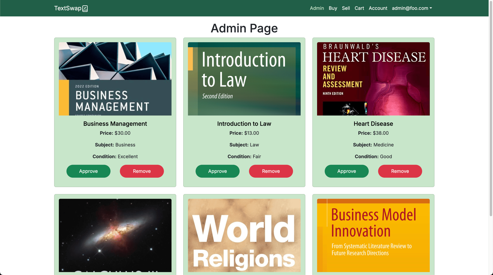
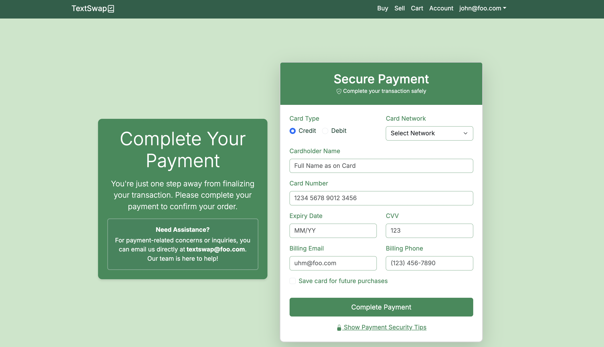
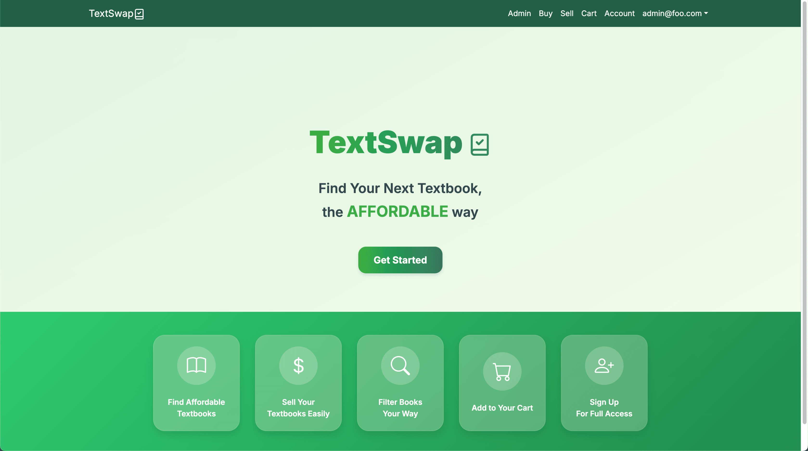

## Affordable, Smart, and Easy Textbooks For Students

TextSwap is a group project that was developed in my ICS 314 Software Engineering class which aimed to provide an efficient and user-friendly platform for college students to buy and sell textbooks. The problem we aimed to address was the high cost of college textbooks and the fact that many students purchase books they only need for a short period, only for those books to go unused afterward. These textbooks could be repurposed by other students who are looking for an affordable, smart, and easy way to access much needed academic resources.

Throughout development, we used various technologies and tools, including Next.js for the framework, React and Bootstrap for the front-end user interface, Javascript for functionality, Prisma and PostgreSQL for database management, Vercel for deployment, and many more. In the process, I gained valuable experience in full-sack development, particularly in building dynamic web applications and managing databases. I also learned the importance of collaborative teamwork, version control, and deployment.

## Features and Functionality

TextSwap offers a variety of features designed to create a seamless experience for students to buy, sell, and manage textbooks:

- **Sign Up, Log In, Change Password**  
   Users can sign up for a new account, log into their existing account, or change their password for security.

- **Navigation Bar**  
   A navigation bar is located at the top of the screen and provides a way to navigate through the different pages of the website and also includes the options to sign up, log in, log out, or change passwords.

- **Sell Page**  
 Users can list textbooks for sale by submitting details about the book through a form. New listings are sent to an admin page for approval before becoming publicly visible.

  

- **Buy Page**  
 This page displays all approved listings. Users can view book details, apply filters, and browse through available textbooks for purchase.

  

- **Cart Page**  
 This page allows users to view and manage books they've saved for purchase. From here, users can either proceed to buy or remove items from their cart.

  

- **Unique Book Pages**  
 Each book has its own dedicated page and provides more in-depth information about the book. Additionally, users are given the option to buy the book or add the book to their cart.

  

- **Account Page**  
 The account page provides users with a personalized view of their profile and listings.

  

- **Admin Page**  
 Admins have the ability to review and approve or remove book new listings submitted by users.

  

- **Payment Page**  
The payment page allows users to securely complete transactions for textbooks they wish to purchase. However, we were unable to complete its functionality on time and instead is currently a placeholder and does not process actually payments, it is designed to simulate a secure checkout experience.

  

## Contributions

My contributions to this project include both the front-end and back-end development:

1. **Mockup Pages**  
   With the use of Canva, I designed initial mockup pages to help visualize the website's layout and flow.

2. **Database**  
   I worked on setting up the database using Prisma, PostgreSQL, and Yup. I created models for books and saved books, along with enumerations for book conditions and subjects. Prisma was used to handle creating, deleting, or modifying book objects and used Yup for schema validation to ensure data integrity.

3. **Cart Page**  
   I developed the Cart Page, focusing on both the front-end and back-end functionality. The page dynamically displays books saved by the user and allows them to either proceed with a purchase or remove books from their cart.

4. **Unique Book Pages**  
   I worked on styling and implementing the back-end functionality for the unique book pages. Using Next.js, I set up dynamic routes and created an API to fetch book details, ensuring each page displayed accurate and relevant book information.

5. **Components**  
   I contributed to creating reusable card components which are used across several pages (e.g., Buy Page, Cart Page, Admin Page, Account Page). This helped ensure consistency in design, styling, and functionality across the website. Each card component were created using Bootstrap React.

6. **Button Design**  
   I handled the functionality of various buttons on the site such as the add to cart, buy now, view details, and admin exclusive buttons.

## [Deployment](https://manoa-textswap.vercel.app/) / [GitHub Page](https://textswap.github.io/Textswap/)

  

##### Creators: Dhaniel Bolosan, Ellie Ishii, Logan Teachout, Xingyao He
